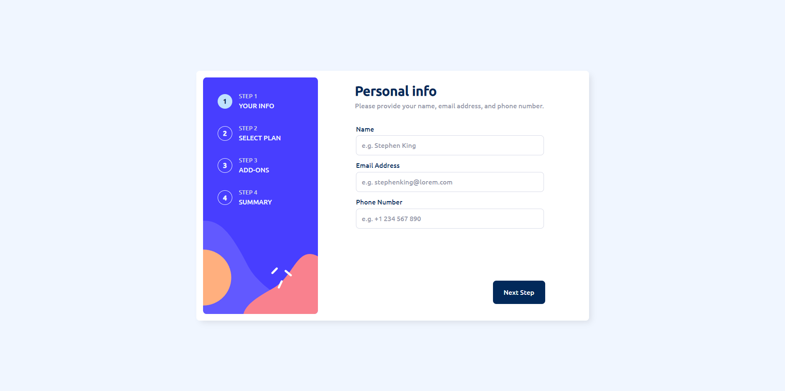

# Frontend Mentor - Multi-step form solution

This is a solution to the [Multi-step form challenge on Frontend Mentor](https://www.frontendmentor.io/challenges/multistep-form-YVAnSdqQBJ). Frontend Mentor challenges help you improve your coding skills by building realistic projects.

## Table of contents

- [Overview](#overview)
  - [The challenge](#the-challenge)
  - [Screenshot](#screenshot)
  - [Links](#links)
- [My process](#my-process)
  - [Built with](#built-with)
  - [What I learned](#what-i-learned)
  - [Continued development](#continued-development)
  - [Useful resources](#useful-resources)
- [Author](#author)

## Overview

### The challenge

Users should be able to:

- Complete each step of the sequence
- Go back to a previous step to update their selections
- See a summary of their selections on the final step and confirm their order
- View the optimal layout for the interface depending on their device's screen size
- See hover and focus states for all interactive elements on the page
- Receive form validation messages if:
  - A field has been missed
  - The email address is not formatted correctly
  - A step is submitted, but no selection has been made

### Screenshot

### Links

- Solution URL: [https://github.com/pablo-moraes/multistep-form](https://github.com/pablo-moraes/multistep-form)
- Live Site URL: [multistep-form](https://multistep-form-sand.vercel.app/)

## My process

### Built with

- Semantic HTML5 markup
- CSS custom properties
- Flexbox
- [Vue 3](https://vuejs.org/) - JS library
- [SCSS](https://sass-lang.com/) - CSS preprocessor

### What I learned

Make this project helped me to remember about Vue, cause I haven't studied it for a long time. I've learned about Vue states and composition API although I haven't used it here well.

### Continued development

I want to learn more about composition API and challenge myself to make elaborate projects.

### Useful resources

- [How to create switch button](https://www.w3schools.com/howto/howto_css_switch.asp) - This really helped me in billing type switch.
- [Vue 3](https://vuejs.org/) - This helped me to understand more about the composition API and event handling.
- [Flex CSS](https://origamid.com/projetos/flexbox-guia-completo/) and [Grid CSS](https://www.origamid.com/projetos/css-grid-layout-guia-completo/) - Here you can find a complete guide that can help you clear up some doubts about these CSS layouts.

## Author

- Frontend Mentor - [@pablo-moraes](https://www.frontendmentor.io/profile/pablo-moraes)
- LinkedIn - [Pablo Moraes](https://www.linkedin.com/in/pablo-moraes001/)
